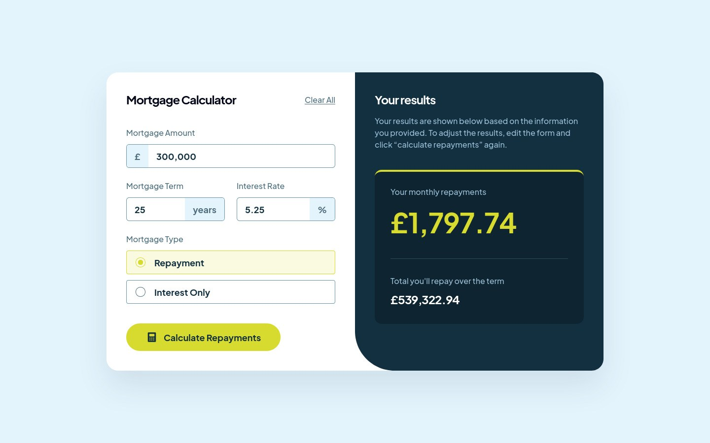

# Frontend Mentor - Mortgage repayment calculator solution

This is a solution to the [Mortgage repayment calculator challenge on Frontend Mentor](https://www.frontendmentor.io/challenges/mortgage-repayment-calculator-Galx1LXK73). Frontend Mentor challenges help you improve your coding skills by building realistic projects.

## Table of contents

- [Overview](#overview)
  - [The challenge](#the-challenge)
  - [Screenshot](#screenshot)
  - [Links](#links)
- [My process](#my-process)
  - [Built with](#built-with)
  - [What I learned](#what-i-learned)
  - [Continued development](#continued-development)
  - [Useful resources](#useful-resources)
- [Author](#author)

## Overview

### The challenge

Users should be able to:

- [x] Input mortgage information and see monthly repayment and total repayment amounts after submitting the form
- [x] See form validation messages if any field is incomplete
- [x] Complete the form only using their keyboard
- [x] View the optimal layout for the interface depending on their device's screen size
- [x] See hover and focus states for all interactive elements on the page

### Screenshot



### Links

- Solution URL: https://www.frontendmentor.io/solutions/mortgage-repayment-calculator-using-react-with-jotai-for-state-mgmt--hc05n7pxZ
- Live Site URL: https://mortgage-calc.pages.dev/

## My process

### Built with

- [React](https://react.dev/) - For building the UI
- [TypeScript](https://www.typescriptlang.org/) - For type safety and better DX
- [Tailwind CSS](https://tailwindcss.com/) - For utility-first, responsive styling
- [shadcn/ui](https://ui.shadcn.com/) - For accessible, customizable UI components
- [React Number Format](https://s-yadav.github.io/react-number-format/) - For localized, formatted number inputs
- [React Hook Form](https://react-hook-form.com/) - For form state management and validation
- [Jotai](https://jotai.org/) - For global state management
- [Motion-Primitives](https://motion-primitives.com/) - For fluid, low-level animation primitives
- [NumberFlow](https://number-flow.barvian.me/) - For smooth, animated number transitions
- [Vite](https://vite.dev/) - For fast development and bundling

### What I learned

I started this challenge because I wanted to try Jotai for state management on a working app. While I was able to wrap my head around the whole "atomic" approach to state management, I also learned (and liked!) a bunch of other tools in the process:

- `shadcn/ui` and its CLI/copy-paste approach for managing components
- `cva` for managing component variants (think "primary" and "secondary" buttons) which makes using Tailwind a little more pleasant

Speaking of Jotai, here's how I implemented the state for the results:

```ts
// state.ts

type MortgageDetails = {
  monthlyPayment: number
  totalPayments: number
  totalInterest: number
}
type MortgageArgs = {
  principal: number
  years: number
  annualRate: number
  type?: 'repayment' | 'interestOnly'
}

const baseAtom = atomWithReset<MortgageDetails>({
  monthlyPayment: 0,
  totalPayments: 0,
  totalInterest: 0,
})
export const mortgageAtom = atom(
  (get) => get(baseAtom),
  (_get, set, newValue: MortgageArgs | typeof RESET) => {
    if (newValue === RESET) {
      set(baseAtom, newValue)
      return
    }

    const { principal, years, annualRate, type } = newValue
    set(baseAtom, calculateMortgage(principal, years, annualRate, type))
  },
)
```

- First, I defined a [resettable atom](https://jotai.org/docs/utilities/resettable) `baseAtom` that contains the shape of the calculation result.
- Then I defined a read-write atom `mortgageAtom` which reads the value of `baseAtom` and contains logic for setting its value - either by resetting it (when the user presses the **Click All** button in the form) or by calculating the mortgage details using the values entered in the form.

I have yet to fully master the differences between other state management libraries like Zustand and Redux, but hopefully that understanding comes the more I use these tools.

Another trick I learned is how to force an element to re-render by changing its `key` prop. This came in handy when I had to uncheck all radio buttons when the user presses **Clear All**. React Hook Form's `useForm` hook has a `reset` function which indeed clears the form values in state, but leaves the currently checked radio button checked, causing the UI and state to be out of sync.

After stumbling upon [this GitHub issue](https://github.com/radix-ui/primitives/issues/1569#issuecomment-1434801848) on the Radix Primitives repo, I was able to fix this by using the `key` prop:

```tsx
function Form() {
  const [key, setKey] = useState(+new Date())
  const form = useForm()

  const onReset = () => {
    form.reset()
    setKey(+new Date()) // workaround to uncheck all radio buttons
  }

  return (
    <form>
      <Button onClick={onReset}>Clear All</Button>
      <RadioGroup key={key}>// radio buttons here</RadioGroup>
    </form>
  )
}
```

### Continued development

- **Amortization schedule** - This wasn't included in the design, but adding a UI for the full repayment breakdown per month would be a significant enhancement to this app.

- **Testing** - In a bigger project, I would've added unit tests to ensure there are no bugs, especially for stuff like form validation and calculation functions.

### Useful resources

- [A deep dive on the UX of number inputs](https://luhr.co/blog/2025/07/01/a-deep-dive-on-the-ux-of-number-inputs/) - David Luhr talks about the oft-overlooked considerations when building a number input. I'd like to build a number input that can evaluate math expressions sometime...
- [The anatomy of shadcn/ui](https://manupa.dev/blog/anatomy-of-shadcn-ui) - I haven't read this yet, but it seems to offer a better understanding of shadcn/ui's approach to reusable components.
- [React Folder Structure in 5 Steps [2025]](https://www.robinwieruch.de/react-folder-structure/) - Why I'm using kebab-case instead of PascalCase for my files.

## Author

- Website - [Josh Javier](https://joshjavier.com/)
- Frontend Mentor - [@joshjavier](https://www.frontendmentor.io/profile/joshjavier)
- Twitter - [@joshjavierr](https://www.twitter.com/joshjavierr)
- LinkedIn - [Josh Javier](https://www.linkedin.com/in/joshjavier/)
